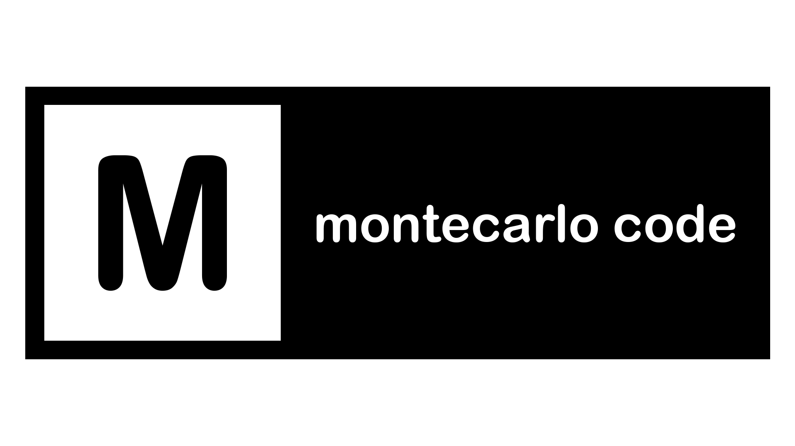
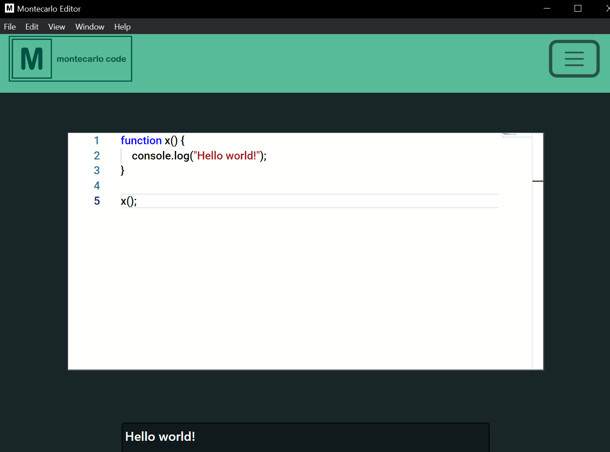

# Montecarlo Code

[![Contributors][contributors-shield]][contributors-url]
[![Forks][forks-shield]][forks-url]
[![Stargazers][stars-shield]][stars-url]
[![Issues][issues-shield]][issues-url]
[![MIT License][license-shield]][license-url]

 

  
<h3 align="center">Montecarlo Code</h3>

  

    Code Editor based on Monaco Editor
     
  

  
Table of Contents

  <ol>
    <li>
      <a href="#about-the-project">About The Project</a>
      <ul>
        <li><a href="#built-with">Built With</a></li>
      </ul>
    </li>
     <li><a href="#disclaimer">Disclaimer</a></li>
    <li><a href="#license">License</a></li>
    <li><a href="#contact">Contact</a></li>
  </ol>

## About The Project

A code editor based on Monaco Editor, supports Java, JavaScript, C, C++, Python and HTML as well as theme selection, file opening & saving, and compilation & running.

(<a href="#readme-top">back to top</a>)

### Built With

* [![Electron][Electron]][Electron-url]

(<a href="#readme-top">back to top</a>)

## Disclaimer

* Tested on Windows 10

(<a href="#readme-top">back to top</a>)

## License

Distributed under the GNU GPL 3.0 License. See [`LICENSE.txt`](https://github.com/diegoal3mx/Montecarlo-Code/blob/master/LICENSE.txt) for more information.

(<a href="#readme-top">back to top</a>)

## Contact

Authors:
* [is-Campos](https://github.com/is-Campos)
* [diegoal3mx](https://github.com/diegoal3mx)

Project Link: [https://github.com/diegoal3mx/Montecarlo-Code](https://github.com/diegoal3mx/Montecarlo-Code)

(<a href="#readme-top">back to top</a>)

[contributors-shield]: https://img.shields.io/github/contributors/diegoal3mx/Montecarlo-Code.svg?style=for-the-badge
[contributors-url]: https://github.com/diegoal3mx/Montecarlo-Code/graphs/contributors
[forks-shield]: https://img.shields.io/github/forks/diegoal3mx/Montecarlo-Code.svg?style=for-the-badge
[forks-url]: https://github.com/diegoal3mx/Montecarlo-Code/network/members
[stars-shield]: https://img.shields.io/github/stars/diegoal3mx/Montecarlo-Code.svg?style=for-the-badge
[stars-url]: https://github.com/diegoal3mx/Montecarlo-Code/stargazers
[issues-shield]: https://img.shields.io/github/issues/diegoal3mx/Montecarlo-Code.svg?style=for-the-badge
[issues-url]: https://github.com/diegoal3mx/Montecarlo-Code/issues
[license-shield]: https://img.shields.io/github/license/diegoal3mx/Montecarlo-Code.svg?style=for-the-badge
[license-url]: https://github.com/diegoal3mx/Montecarlo-Code/blob/master/LICENSE.txt
[linkedin-shield]: https://img.shields.io/badge/-LinkedIn-black.svg?style=for-the-badge&logo=linkedin&colorB=555
[linkedin-url]: https://linkedin.com/in/linkedin_username
[product-screenshot]: images/Montecarlo-Code-Screenshot.png
[Electron]: https://img.shields.io/badge/Electron-2B2E3A?style=for-the-badge&logo=electron&logoColor=9FEAF9
[Electron-url]:https://www.electronjs.org/
